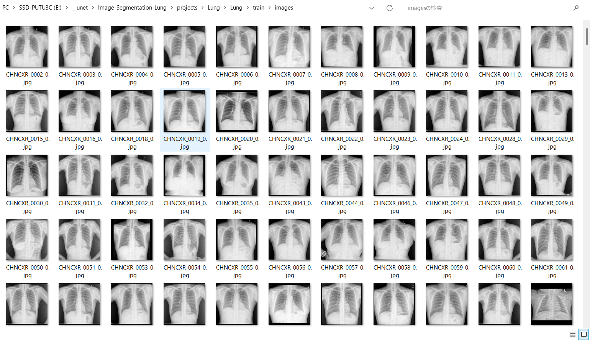
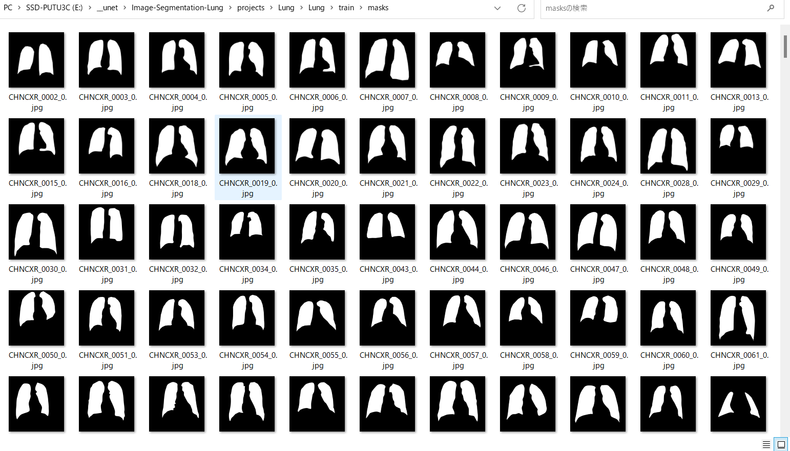
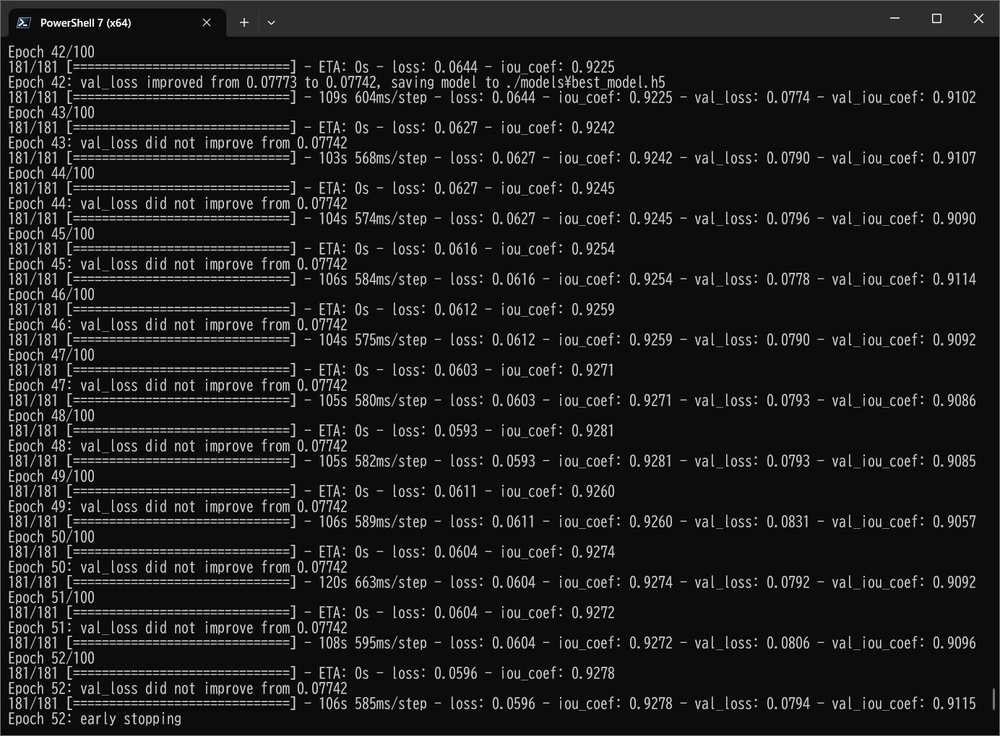
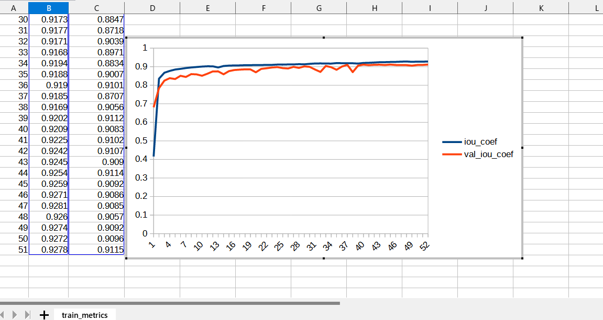
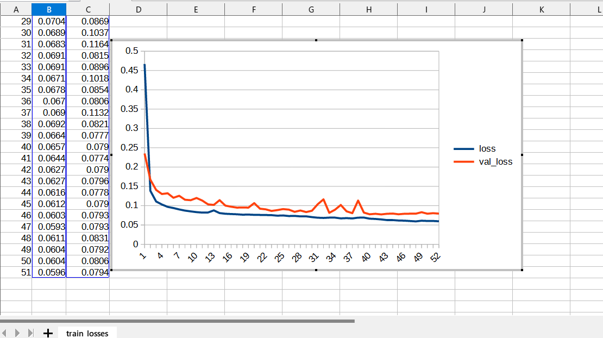
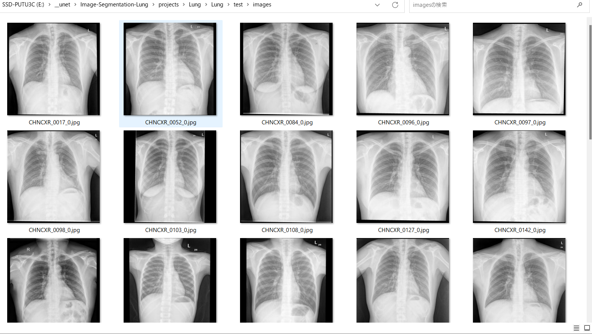
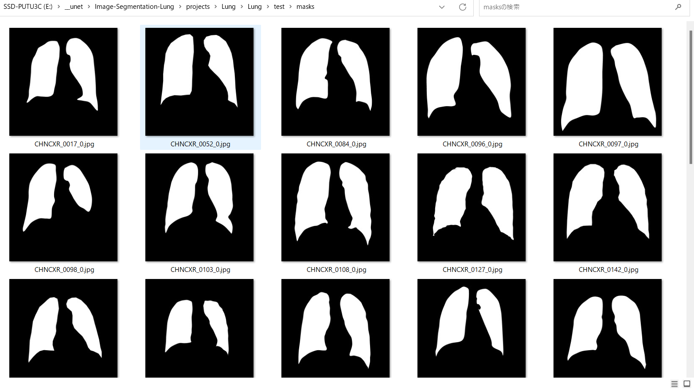
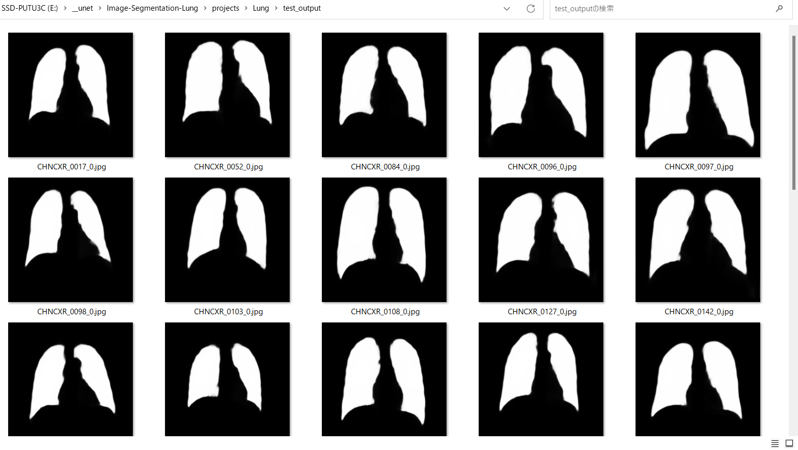
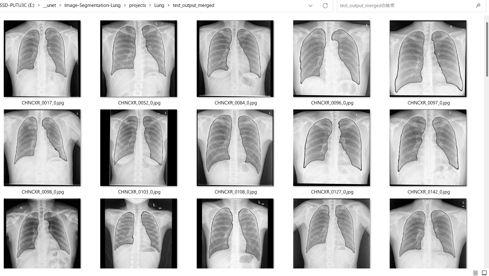

# Image-Segmentation-Lung (2023/07/30)
<h2>
1 Image-Segmentation-Lung 
</h2>

This is an experimental project for Image-Segmentation of Lung by using
 <a href="https://github.com/atlan-antillia/Tensorflow-Slightly-Flexible-UNet">Tensorflow-Slightly-Flexible-UNet</a> Model,
which is a typical classic Tensorflow2 UNet implementation <a href="./TensorflowUNet.py">TensorflowUNet.py</a> 

The image dataset used here has been taken from the following web site.

<pre>
Chest Xray Masks and Labels
https://www.kaggle.com/datasets/nikhilpandey360/chest-xray-masks-and-labels
</pre>
<b>About Dataset</b>
<pre>
The dataset contains x-rays and corresponding masks. Some masks are missing so it is advised to cross-reference the images and masks.
Original Dataset before modification
The OP had the following request:
It is requested that publications resulting from the use of this data attribute the source (National Library of Medicine, National 
Institutes of Health, Bethesda, MD, USA and Shenzhen No.3 People’s Hospital, Guangdong Medical College, Shenzhen, China) and cite 
the following publications:
Jaeger S, Karargyris A, Candemir S, Folio L, Siegelman J, Callaghan F, Xue Z, Palaniappan K, Singh RK, Antani S, Thoma G, Wang YX, 
Lu PX, McDonald CJ. Automatic tuberculosis screening using chest radiographs. 
IEEE Trans Med Imaging. 2014 Feb;33(2):233-45. doi: 10.1109/TMI.2013.2284099. PMID: 24108713
Candemir S, Jaeger S, Palaniappan K, Musco JP, Singh RK, Xue Z, Karargyris A, Antani S, Thoma G, McDonald CJ. 
Lung segmentation in chest radiographs using anatomical atlases with nonrigid registration. 
IEEE Trans Med Imaging. 2014 Feb;33(2):577-90. doi: 10.1109/TMI.2013.2290491. PMID: 24239990
Montgomery County X-ray Set
X-ray images in this data set have been acquired from the tuberculosis control program of the Department of Health and Human Services 
of Montgomery County, MD, USA. This set contains 138 posterior-anterior x-rays, of which 80 x-rays are normal and 58 x-rays are abnormal
 with manifestations of tuberculosis. All images are de-identified and available in DICOM format. The set covers a wide range of 
 abnormalities, including effusions and miliary patterns. The data set includes radiology readings available as a text file.
Ideas
Experiment with lung segmentation
Build disease classifiers for various conditions
Test models on data across different manufacturers
Build GANs that are able to make the datasets indistinguishable 
(Adversarial Discriminative Domain Adaptation: https://arxiv.org/abs/1702.05464)
</pre>
<b>License</b> 
CC0: Public Domain
 
 
<h2>
2. Install Image-Segmentation-Lung 
</h2>
Please clone Image-Segmentation-Lung.git in a folder <b>c:\google</b>. 
<pre>
>git clone https://github.com/sarah-antillia/Image-Segmentation-Lung.git 
</pre>
You can see the following folder structure in your working folder. 

<pre>
Image-Segmentation-Lung 
├─asset
└─projects
    └─-Lung
        ├─eval
        ├─generator
        ├─mini_test
        ├─models
        ├─Lung
        │   ├─test
        │   │  ├─images
        │   │  └─masks
        │   ├─train
        │   │  ├─images
        │   │  └─masks
        │   └─valid
        │       ├─images
        │       └─masks
        ├─test_output
        └─test_output_merged
</pre>

<h2>
3 Prepare dataset
</h2>

<h3>
3.1 Download master dataset
</h3>
  Please download the original image and mask dataset smear2005.zip from the following link 
<pre>
Chest X-ray Database
</pre>
The dataset <b>Lung Segmentation</b> has the following folder structure, which contains seven categories. 
<pre>
./Lung Segmentation
├─CXR_png
├─masks
└─test
</pre>
The width of the X-Ray image and mask in these folders is from 2K to 3K, and they are not square size.
<h3>
3.2 Create image and mask dataset
</h3>
By using Python script <a href="./projects/Lung/generator/ImageMaskDatasetGenerator.py">ImageMaskDatasetGenerator.py</a>,
 we have created <b>Lung-master</b> dataset from the original image files in <b>CXR_png</b> folder and mask files in <b>masks</b>
 folder. 
The script performs the following image processings. 
<pre>
1 Create 512x512 square images from original X-Ray image files.
2 Create 512x512 square mask  corresponding to the X-Ray image files. 
3 Create mirrored images and masks of size 512x512 to augment the resized square images and masks.
</pre>

The created <b>Lung-master</b> dataset has the following folder structure. 
<pre>
./Lung-master
 ├─images
 └─masks
</pre>

<h3>
3.3 Split master to test, train and valid 
</h3>
By using Python script <a href="./projects/Lung/generator/split_master.py">split_master.py</a>,
 we have finally created <b>Lung</b> dataset from the Lung-master. 
<pre>
./Lung
├─test
│  ├─images
│  └─masks
├─train
│  ├─images
│  └─masks
└─valid
    ├─images
    └─masks
</pre>
<b>train/images samples:</b> 

 
<b>train/masks samples:</b> 

 

<h2>
4 Train TensorflowUNet Model
</h2>
 We have trained Lung TensorflowUNet Model by using the following
 <b>train_eval_infer.config</b> file.  
Please move to ./projects/Lung directory, and run the following bat file. 
<pre>
>1.train.bat
</pre>
, which simply runs the following command. 
<pre>
>python ../../TensorflowUNetTrainer.py ./train_eval_infer.config
</pre>
, where train_eval_infer.config is the following.
<pre>
; train_eval_infer.config
; Dataset of Lung
; 2023/07/29 (C) antillia.com

[model]
image_width    = 512
image_height   = 512
image_channels = 3
num_classes    = 1
base_filters   = 16
base_kernels   = (7,7)
num_layers     = 7
dropout_rate   = 0.07
learning_rate  = 0.0001
clipvalue      = 0.5
dilation       = (2,2)
loss           = "bce_iou_loss"
metrics        = ["iou_coef"]
show_summary   = False

[train]
epochs        = 100
batch_size    = 4
patience      = 10
metrics       = ["iou_coef", "val_iou_coef"]
model_dir     = "./models"
eval_dir      = "./eval"
image_datapath = "./Lung/train/images"
mask_datapath  = "./Lung/train/masks"
create_backup  = True

[eval]
image_datapath = "./Lung/valid/images"
mask_datapath  = "./Lung/valid/masks"
output_dir     = "./eval_output"

[infer] 
;images_dir = "./mini_test/"
images_dir = "./Lung/test/images"
output_dir = "./test_output"
merged_dir = "./test_output_merged"

[mask]
blur      = True
binarize  = True
threshold = 74
</pre>

Please note that the input image size and base_kernels size of this Lung TensorflowUNet model are slightly large. 
<pre>
[model]
image_width    = 512
image_height   = 512
base_kernels   = (7,7)
</pre>

The training process has just been stopped at epoch 52 by an early-stopping callback as shown below.  
 
 
 
<b>Train metrics line graph</b>: 
 
 
<b>Train losses line graph</b>: 
 

<!--
<h2>
5 Evaluation
</h2>
 We have evaluated prediction accuracy of our Pretrained Lung Model by using <b>valid</b> dataset. 
Please move to ./projects/Lung/ directory, and run the following bat file. 
<pre>
>2.evalute.bat
</pre>
, which simply runs the following command. 
<pre>
>python ../../TensorflowUNetEvaluator.py ./train_eval_infer.config
</pre>
The evaluation result is the following. 
 
 
-->
<h2>
5 Inference 
</h2>
We have also tried to infer the segmented region for 
<pre>
images_dir    = "./Lung/test/images" 
</pre> dataset defined in <b>train_eval_infer.config</b>,
 by using our Pretrained Lung UNet Model. 
Please move to ./projects/Lung/ directory, and run the following bat file. 
<pre>
>3.infer.bat
</pre>
, which simply runs the following command. 
<pre>
>python ../../TensorflowUNetInferencer.py ./train_eval_infer.config
</pre>

<b><a href="./projects/Lung/Lung/test/images">Test input images</a> </b> 
 
 
<b><a href="./projects/Lung/Lung/test/masks">Test input ground truth mask</a> </b> 
 
 

<b><a href="./projects/Lung/test_output/">Inferred images </a>test output</b> 
 
 
 

<b><a href="./projects/Lung/test_output_merged">Inferred merged images (blended test/images with 
inferred images)</a></b> 
  

 
<h3>
References
</h3>
<b>1. Chest Xray Masks and Labels</b> 
https://www.kaggle.com/datasets/nikhilpandey360/chest-xray-masks-and-labels 

